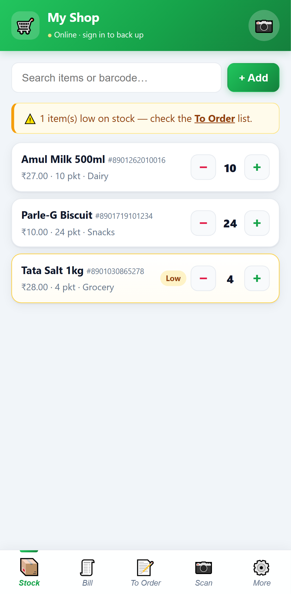
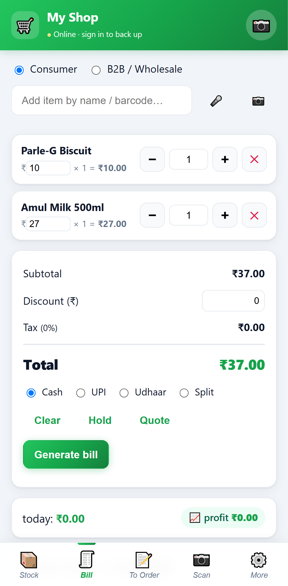
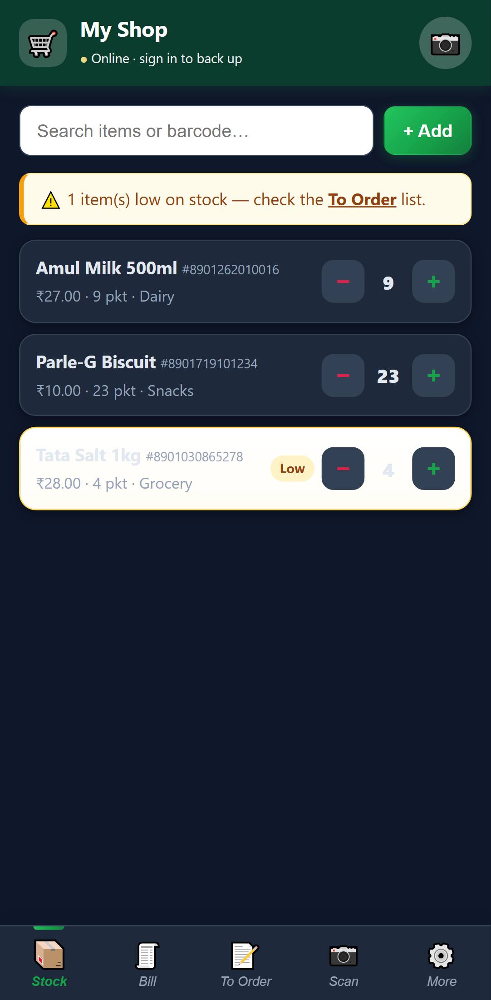

# Look Inventory — offline inventory + billing app for small rural shops

A **$0-cost, offline-first** Progressive Web App (PWA) that lets a shopkeeper:

- 📦 List every item with price, description, **photo**, quantity, unit, category, **expiry date**
- ➖ Tap to **record a sale** (stock goes down) and ➕ to add stock
- 🧾 **Bill customers** (consumer & B2B/wholesale) with **printable/shareable receipts**, tax/GST, discounts, UPI payment
- 📒 **Khata (Udhaar/credit ledger)** — track who owes money, send WhatsApp reminders
- 📊 **Sales reports** — today/week/month totals, profit, best-sellers
- 📝 **To-Order list** that fills automatically when items run low; **mark received** to restock; send the list to the wholesaler on WhatsApp
- 📷 **Scan barcodes** with the phone camera; 🎤 **voice** item entry
- 🌐 **7 languages**: English, हिन्दी, ଓଡ଼ିଆ, বাংলা, தமிழ், తెలుగు, मराठी
- ☁️ **Back up to Google Drive** when online — and keep working with **no internet** any time

No app store, no server, no monthly bills. Data is stored **on the phone** (IndexedDB) and works completely offline.

📸 **[See screenshots →](SCREENSHOTS.md)**

|  |  |  |
|---|---|---|
|  |  |  |

---

## How to run it (try it in 30 seconds)

Because the camera and "install to phone" features need HTTPS or `localhost`, serve the folder with any tiny local web server.

**Option A — Python (already on most machines):**
```sh
cd lookinventory
python -m http.server 8080
```
Then open `http://localhost:8080` in Chrome.

**Option B — Node:**
```sh
cd lookinventory
npx serve .
```

On a phone, open the same URL (use your PC's IP, e.g. `http://192.168.1.5:8080`) over the same Wi-Fi, **or** deploy it free (below) and open the public link.

> The app ships with 3 sample items so you can see it working immediately. Delete them from the **Stock** tab once you start adding your own.

---

## Deploy it free (so the shopkeeper just opens a link)

Any of these are $0 and give you an HTTPS link. Just upload this whole folder:

- **GitHub Pages** — push the folder to a repo, enable Pages. URL like `https://you.github.io/lookinventory/`
- **Netlify Drop** — drag the folder onto https://app.netlify.com/drop
- **Cloudflare Pages** / **Vercel** — connect the repo, no build command needed

Then on the phone: open the link in Chrome → menu → **Add to Home screen**. It now opens like a normal app with its own icon and works offline.

---

## Using the app

| Tab | What it does |
|-----|--------------|
| **Stock** | All items. `−` records a sale, `+` adds stock. Tap a row for full details. Search by name/barcode/category. `+ Add` creates an item. |
| **Bill** | Make a bill for **Consumer** or **B2B / Wholesale**. Add items by search or barcode scan, edit per-line price (for wholesale rates), apply a discount, auto-add tax/GST. **Generate bill** → stock is deducted, the sale is saved, and a printable receipt opens. **Print / Save PDF** or **Share** to WhatsApp. Sales history with today's total is at the bottom. |
| **To Order** | Auto-lists low-stock items. Set the order quantity, then **tick the box when the wholesaler delivers** — that quantity is added back into stock. "Clear done" tidies the list. |
| **Scan** | Start the camera and point at a barcode. Known item → opens details. Unknown → offers to add it with the barcode pre-filled. |
| **More** | Shop details (name, phone, address, GSTIN, tax %) shown on receipts, Google Drive backup, and file export/import. |

**Billing is fully offline.** Receipts print via the phone's print dialog (also "Save as PDF") and share as text to WhatsApp. Set your **tax/GST %** and shop details in the **More** tab so they appear on every receipt. Each bill gets a running invoice number. All sales are included in backups.

An item is "low" when its quantity drops to or below its **Reorder at** number (set per item when adding/editing).

---

## Developer: Google sign-in setup (free, ONE time for the whole app, ~3 minutes)

This is the **developer's** one-time step. Each shopkeeper then just taps "Sign in with Google" — they sign into **their own** Google Drive (their free 15 GB, hidden app folder); your Client ID only identifies the app.

1. Go to https://console.cloud.google.com/ and create a project (free).
2. **APIs & Services → Library →** enable **Google Drive API**.
3. **APIs & Services → OAuth consent screen →** choose **External**, fill app name + your email. (To let *any* shopkeeper sign in, publish the consent screen; while in "testing" only added test users can sign in.)
4. **APIs & Services → Credentials → Create Credentials → OAuth client ID → Web application.**
   - Under **Authorized JavaScript origins**, add your app's URL (e.g. `http://localhost:8080` and your deployed `https://…` URL).
5. Copy the **Client ID** (looks like `1234-abc.apps.googleusercontent.com`).
6. **Paste it into `js/config.js` → `googleClientId`** and re-deploy. Done — every shopkeeper now gets one-tap sign-in.

> No Google setup at all? The app still works fully offline, and shopkeepers can use **More → Export backup file** to save a `.json` to Jio Cloud / WhatsApp / Drive and **Import** later. Backups **merge** by barcode, keeping the most recently edited version of each item.

---

## B2B & accounting features

- **Receivables + aging** (More → Receivables): outstanding **per invoice**, bucketed 0–30 / 30–60 / 60–90 / 90+ days, with overdue flags based on **credit terms** (set days in Shop details).
- **Partial payments**: record installments against an invoice; the customer's Khata balance drops automatically; the invoice settles when fully paid.
- **Quotations** (Bill → Quote): save a cart as a quotation, then **convert it to an invoice** later (More → Quotations).
- **Customer statement**: from a Khata customer's History, **share a statement** (all invoices, paid, outstanding) on WhatsApp.
- **Wholesale / tiered pricing**: per item set a **wholesale price + min qty**; B2B bills and large quantities auto-apply the wholesale rate (manual price edits are respected).
- **Delivery challan**: print a goods-movement challan (items + qty, no prices) from any receipt.
- **Expenses → net profit**: log rent/electricity/salary; Reports show **gross profit, expenses, and net P&L** for the month.
- **Inventory valuation**: stock value at cost & MRP, and potential margin.
- **Quick-sell favourites**: star items to get a one-tap grid on the Bill tab.
- **Low-margin guard**: warns before selling below cost.

## Production-hardening (industry-standard)

- **Money is computed in integer paise** then converted to rupees — no floating-point rounding bugs — with a **round-off** line on bills (standard Indian invoice practice).
- **GST**: per-item **HSN/SAC** + GST %, **financial-year invoice numbers** (`INV/2025-26/0001`), **CGST/SGST split** on receipts when your GSTIN is set, and a **GSTR-ready CSV** export (Reports → GSTR CSV).
- **Retail flows**: **returns/refunds** (credit note + restock), **split payment** (cash + UPI + Udhaar on one bill), **park/hold** multiple bills, and **stock adjustment** with a reason (damage/theft/expiry/recount).
- **Feature flags**: every major feature can be turned on/off in **More → Features** (or baked into `js/config.js → flags`). Disabled features vanish from the UI.
- **PWA update prompt**: when a new version is deployed, a "New version ready — Refresh" banner appears instead of users getting stuck on a stale cache.
- **Privacy & data safety**: in-app **Privacy & terms**, a [PRIVACY.md](PRIVACY.md) for app-store listing, and a [firestore.rules](firestore.rules) file to lock down live-sync. Firestore sync auto-trims very long history to stay under the 1 MiB document limit (full history stays local + in Drive backups).

## Production build (hardened) & deploy

```sh
npm install
npm run build      # → ./dist : one obfuscated bundle, console + debugger disabled
```

`dist/` is what you deploy. **Vercel** is already configured (`vercel.json`): it runs `npm run build` and serves `dist/`. Import the repo, framework preset **Other**, deploy.

> **Honest security note.** The build minifies + obfuscates the JS, strips `console`, and adds anti-DevTools/self-defending measures — this **deters casual copying and hides logic**, but any code that runs in a browser can ultimately be read by a determined person. It is *hardening, not DRM*. The only truly uncrackable logic lives on a server, which this offline-first app intentionally avoids. Don't put real secrets (API keys you must protect) in the client.

## Admin remote access control (kill switch)

You (the admin) can disable the app on any device, even after it's deployed:

1. Host a small JSON you control (GitHub raw, a Vercel route, a gist) — e.g.
   ```json
   { "killAll": false, "blocked": ["D-XXXX-YYYY"], "message": "Subscription expired — contact us." }
   ```
2. Put its URL in `js/config.js → accessListUrl` and rebuild.
3. Each device shows its **Device ID** under **More → About**. To revoke one, add that ID to `"blocked"` (or set `"killAll": true` to disable everyone). The device locks the next time it's online and stays locked.

**Limits (honest):** enforcement is client-side and checked **when online** — a device that's offline can't be reached until it reconnects, and a determined user could bypass a purely client-side check. For hard enforcement you'd need server-validated licensing. This is good for legitimate "expired/abuse" revocation, not for stopping a skilled attacker.

## Testing (Playwright E2E)

End-to-end tests run in a real mobile-Chrome profile:

```sh
npm install
npm run test:install   # one-time: downloads the test browser
npm test               # runs e2e/app.spec.js (starts a local server automatically)
npm run test:ui        # interactive mode
```

Covered (16 tests, all passing): onboarding skip, seeding, search, add item, sale/stock decrement, billing→receipt, money round-off, feature-flag gating, low-stock list, **offline billing (internet off)**, split payment, park/resume a bill, returns/refund restock, cashier-mode PIN lock, **credit→receivable→partial payment**, **quotation→invoice**, and **expense→net profit**.

### Works with OR without internet (verified)
A dedicated test makes a complete bill with `context.setOffline(true)` and confirms the sale persists — proving the shopkeeper is never blocked by connectivity. When internet returns, the app auto-reconnects live sync and flushes a backup. Online features (Google sign-in, Firebase, voice) load lazily and fail gracefully, so being online never slows or breaks the core app.

### Roles (cashier vs owner)
Set a PIN, then **More → Enter cashier mode**: Reports, Purchases, Day-close, Returns, Stock-adjust and all settings are hidden so staff can bill but not see profits or change prices. Exiting requires the owner PIN.

## Setup model: developer once, shopkeeper one-tap

There are **two different "setups"** — don't confuse them:

- **You (developer/owner) set up ONCE, before deploying** — fill `js/config.js` with a single Google OAuth **Client ID** (free, 3-min steps below). Re-deploy. That's it, forever.
- **Each shopkeeper** then just opens the app → a **first-run wizard** appears: pick language → shop name/phone → UPI → **tap "Sign in with Google"** → done. They **never** see a Client ID or any config. The wizard can be re-run anytime from **More → Run setup again**, and progress is shown as a checklist in **More**.

After that one Google sign-in, the shopkeeper gets **automatic backup** on every change, and **automatic restore** when they sign in on a new phone (same Google account → data follows them). Install-to-home-screen is offered in the wizard too.

> If you leave `js/config.js` blank, the app still works — it falls back to the manual Client-ID field in Settings (advanced). For a polished product, set it once.

## Newest features — quick guide

- **🎤 Voice billing (Odia / Hindi / English + regional):** on the **Bill** tab tap the mic and speak your order — e.g. *"2 Parle-G, 1 Tata Salt"* or in Hindi/Odia with number-words. Items are matched to your stock and added to the cart automatically. (Needs internet — the browser speech engine is online; everything else is offline.)
- **🔥 Live multi-device sync (Firebase, optional):** **More → Live sync** — paste a free Firebase config + a shared shop code on each phone. Owner and helper then stay in sync in real time when online, and offline changes auto-queue and sync when back online. Setup steps below.
- **🔒 Data durability:** the app now requests **persistent storage** (browser won't auto-delete your data) and **auto-backs-up to Drive on every change** when signed in. A status line in **More → File backup** tells you if storage is protected.
- **📈 Profit today:** the Bill tab shows today's sales **and profit** at a glance.
- **🧠 Smart reorder:** the To-Order list suggests quantities from real **sales velocity** (covers ~2 weeks) and shows each item's weekly sales rate.
- **💤 Dead-stock report:** **More → Reports** lists items in stock with **no sale in 60 days** so you can clear or stop reordering them.
- **💳 Customer pay-link:** Khata reminders now include a **tappable UPI link with the exact balance** — the customer taps and their UPI app opens pre-filled.

## Earlier "latest" features — quick guide

- **Barcode label generator (offline):** in an item, tap **Generate** next to Barcode to assign a code to a loose/unpackaged product. Then **More → Labels**, select items, and **Print** a sheet of scannable Code128 stick-on labels (name + price + barcode). After that, scanning works for *everything*, not just packaged goods. (Generator in `js/barcode.js` — pure, no library.)
- **Fast search + load-more:** the Stock search is debounced and matches name/barcode/category with multi-word support; the list renders in pages of 50 with a **Load more** button, so thousands of items stay smooth.
- **Payment method + Day close:** each bill is tagged **Cash / UPI / Udhaar**. **More → Day close** shows today's total split by method, plus a change calculator.
- **Reports++:** **More → Reports** now has a month picker, day-wise breakdown, GST-collected summary, and **Export CSV** (opens in Excel/Sheets).
- **Purchases + suppliers:** **More → Purchases** records stock-in from wholesalers — it **adds to stock, updates cost price**, and tracks **supplier balances** (what you owe).
- **Weight/decimal billing:** cart quantity is editable and accepts decimals (e.g. 0.5 kg) for items priced by weight/volume. Items also have a **units-per-pack** field for box→piece tracking.
- **PIN lock:** **More → App lock** sets a 4–6 digit PIN (hashed with SHA-256) shown on every open.
- **Dark mode & large text:** **More → Appearance** — easier in low light and for older shopkeepers.
- **Customer history:** in **Khata**, tap **History** on a customer to see their past bills and **Repeat last order** into the cart.

## Earlier features — quick guide

- **Khata / Udhaar** (More → Khata): add customers and credit/payment entries; balances are computed automatically. On a bill, tick **"Unpaid — add to Khata"** to record the amount as Udhaar. Tap **Remind** to send a WhatsApp payment reminder.
- **Reports** (More → Reports): today / this week / this month sales + profit (uses your cost price), and 30-day best-sellers.
- **Language** (More → Language): switch among 7 languages instantly. Regional translations are starter sets — edit `js/i18n.js` to refine wording.
- **Photo & voice**: add a product photo (camera) and dictate the item name with 🎤 (voice needs internet on most browsers).
- **Expiry alerts**: set an expiry date per item; the Stock tab shows a banner and per-item badges for items expiring within 30 days / already expired.
- **UPI payments**: in More, set your **UPI ID** and upload **your UPI QR image** (the one from PhonePe/GPay). Both print on every receipt, plus a tappable **"Pay via UPI"** button that opens the customer's UPI app with the exact amount.
- **Receipt as image**: the **Share image** button renders the receipt to a PNG — ideal for WhatsApp.
- **Bluetooth printer (experimental)**: 🖨️ BT on the receipt tries to print to a generic 58mm ESC/POS Bluetooth printer via Web Bluetooth (Chrome/Android only; support varies by printer model).
- **Share this app**: More → Share spreads your install link — every shared receipt also carries your shop name for organic reach.

## Files

```
index.html              App shell + dialogs + first-run wizard
manifest.webmanifest    PWA metadata (installable)
sw.js                   Service worker (offline caching)
css/styles.css          Mobile-first styling
js/config.js            DEVELOPER fills once: Google Client ID (+ optional Firebase)
js/i18n.js              7-language translations + apply engine
js/db.js                IndexedDB storage (items, sales, khata, purchases, settings)
js/app.js               UI, rendering, all actions
js/scanner.js           Camera barcode scanning (BarcodeDetector API)
js/barcode.js           Offline Code128 barcode generator (for labels)
js/sync.js              Google Drive backup/restore
js/cloud.js             Optional Firebase Firestore live multi-device sync
js/btprint.js           Experimental Bluetooth ESC/POS printing
icons/icon.svg          App icon
```

> Architecture note: this stays a **pure PWA on IndexedDB** — no backend, by design. A server (FastAPI/Node/Firebase paid) would add cost and break offline use. IndexedDB is the standard offline-first database (used by WhatsApp Web, Google Docs offline, etc.) and handles tens of thousands of items fast. A backend only earns its cost for multi-shop cloud dashboards — see Roadmap.

## Notes & limits

- **Barcode scanning** and **voice** use the browser's built-in APIs, supported in **Chrome on Android**. On unsupported browsers the app tells the user and offers manual entry — everything else still works.
- All data is local to the device/browser. Clearing browser data deletes it — that's why backups exist. Backups now include items, sales, Khata, and all settings.
- No accounts, no tracking, no external dependencies except Google's sign-in script (loaded only when you choose to back up).

## Firebase live-sync setup (free, optional, ~5 minutes)

Only needed if you want **two phones live at once** (owner + helper). The app works fully offline without this.

1. Go to https://console.firebase.google.com/ → **Add project** (free).
2. **Build → Firestore Database → Create database** (start in test mode for now).
3. **Project settings → General → Your apps → Web app (`</>`)** → register; copy the **firebaseConfig** object's values.
4. In the app: **More → Live multi-device sync** → paste the config as JSON, e.g.
   `{"apiKey":"...","authDomain":"...","projectId":"...","appId":"..."}`
5. Enter the **same shop code** on every phone (e.g. `dillip-shop-123`) → **Connect & sync**.
6. **Before going live, tighten Firestore rules** so only your shop code is writable (test mode is open to anyone who knows your project). A simple rule: restrict `shops/{code}` to your chosen code, or add Firebase Auth.

Data is stored as a single document at `shops/<shop code>`. Free Spark tier (≈50k reads / 20k writes per day) is plenty for a shop. Offline changes queue and sync automatically when back online.

## Roadmap (not yet built — need external setup/hardware)

- **Play Store listing:** the app already installs free via "Add to Home screen." To list on Play Store, wrap the PWA in a **Trusted Web Activity** (TWA) with [Bubblewrap](https://github.com/GoogleChromeLabs/bubblewrap) — Play Store has a one-time $25 developer fee; hosting/app stays $0. Or keep it a pure PWA (fully free, no store).
- **Dynamic-amount UPI QR:** today the receipt prints your saved static QR + tappable amount links (incl. Khata reminders). A per-bill QR with the amount baked in would need a QR-encoder library.
