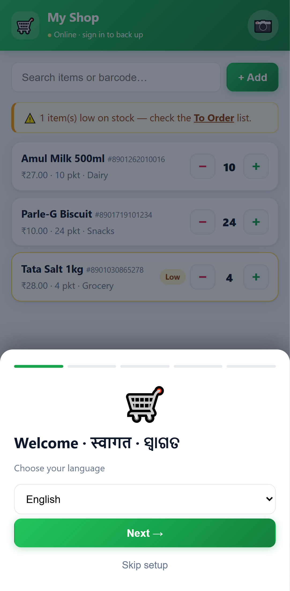
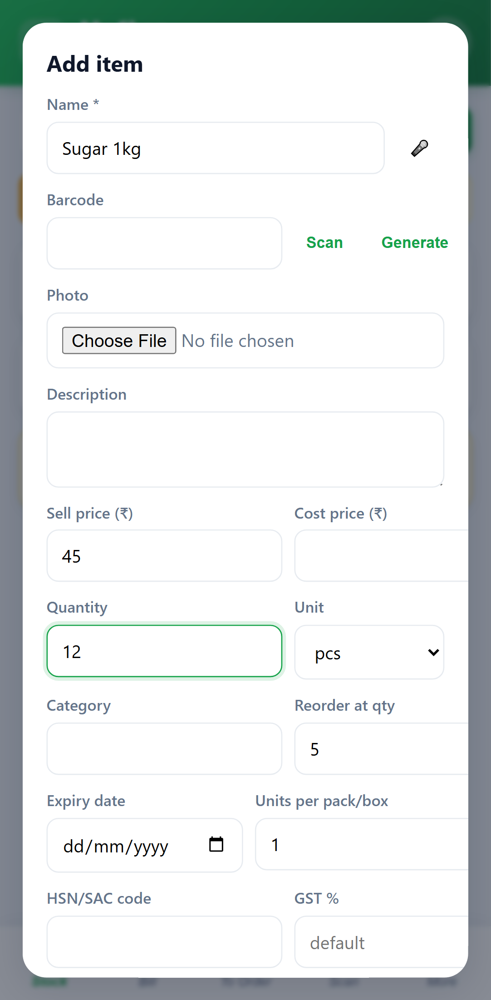
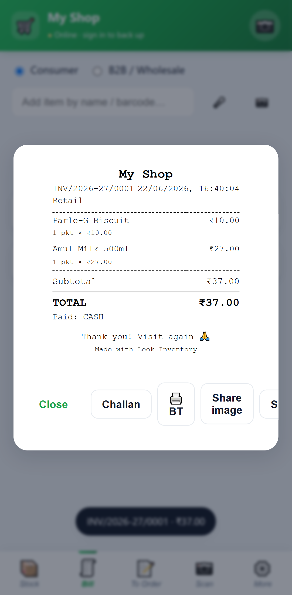
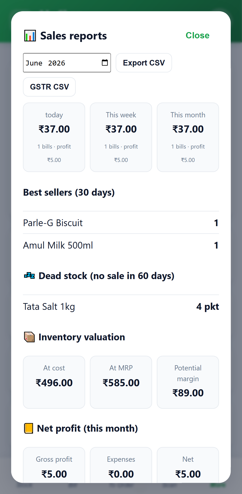
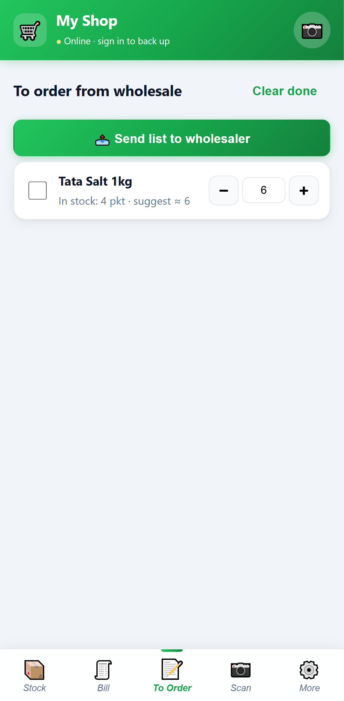
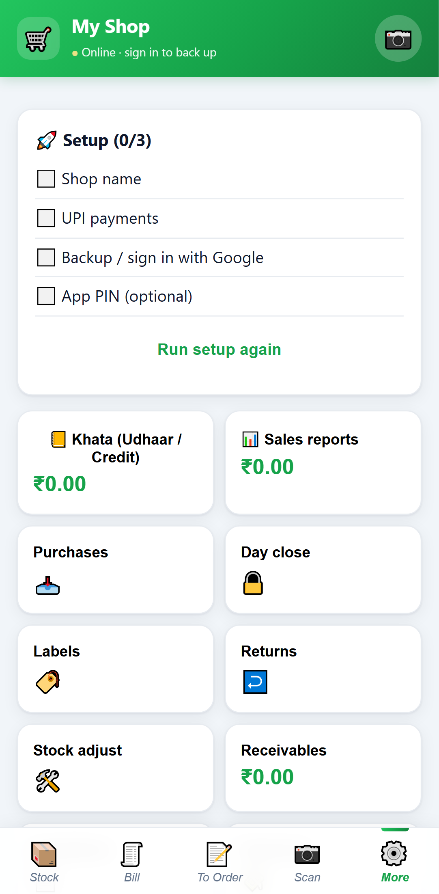
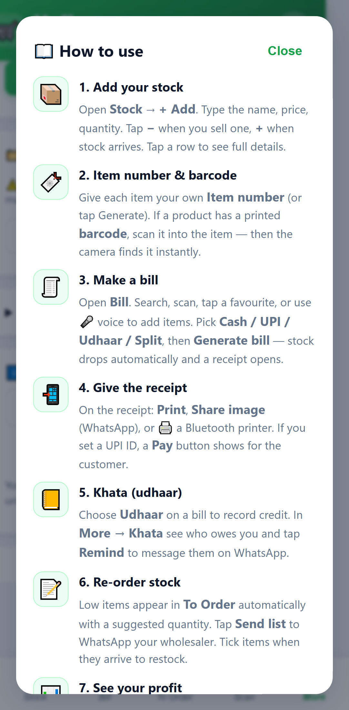

# Look Inventory — Screenshots

Captured live from the running app (mobile Chrome / Pixel 7 profile).

| Onboarding | Stock | Add item |
|---|---|---|
|  |  |  |

| Billing (split pay + profit) | Receipt | Reports |
|---|---|---|
|  |  |  |

| To-Order (smart reorder) | More / hub | Dark mode |
|---|---|---|
|  |  |  |

| Built-in tutorial |
|---|
|  |

> Regenerate anytime: `npm start` (serves on :8080), then `node tools/shots.js` → writes to `shots/`.
